# Customers — screen gallery

Every screen and state in the Customers feature, captured from the running app
at 390×844 @2x. No mockups — each frame came from driving the real UI.

A customer record in better tailor is not a contact card. It is **a set of
numbers a garment gets cut to**, with a name and a phone attached. Everything
here exists to get those numbers saved once and then re-used without retyping.
The build spec for porting this to native iOS and Android is
[ADR 0003](../../adr/0003-customers-feature.md).

---

## 1. The list

Sorted newest-first, one card per customer. Each card carries the two things a
tailor needs before deciding to tap: how to reach them, and how much history
they have.

| | | |
|:--|:--|:--|
| 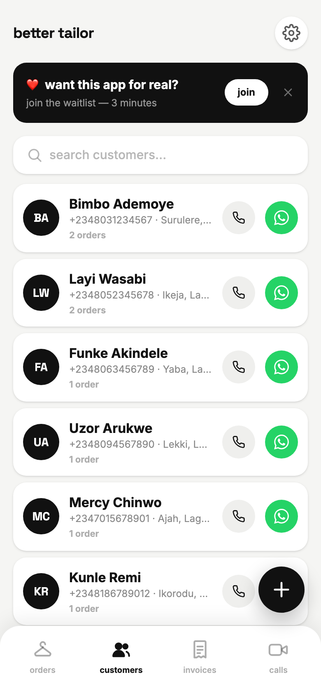 | 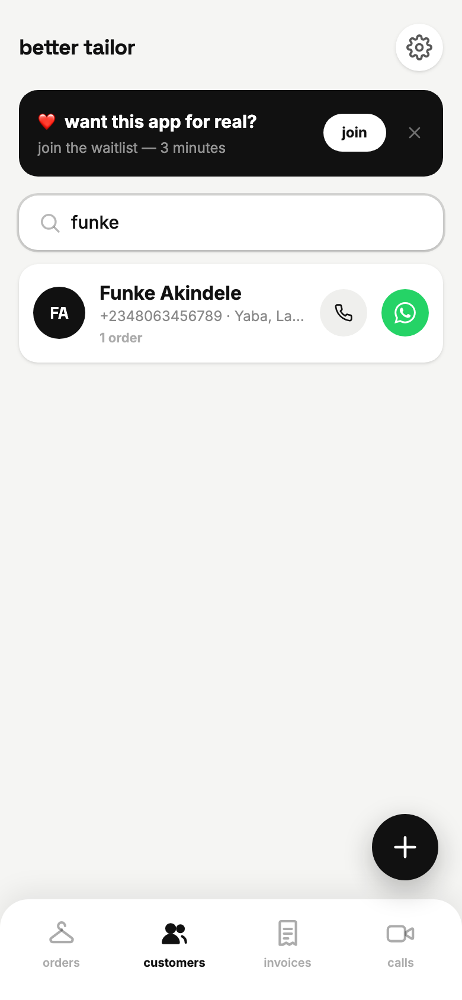 | 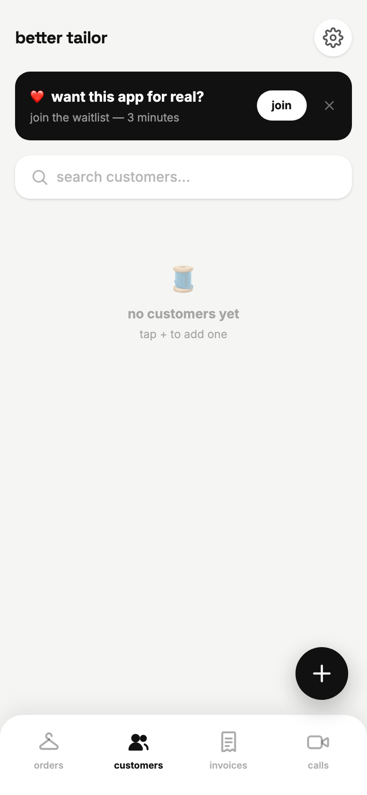 |
| **01** — Name, phone · area, and an order count. Call and WhatsApp are on the row itself, so reaching someone never costs a screen. | **02** — One search box, matching on name only. A tailor searches for "funke", not for a phone number. | **17** — Empty state points at the one action that resolves it. |

## 2. Creating a customer

| | | |
|:--|:--|:--|
| 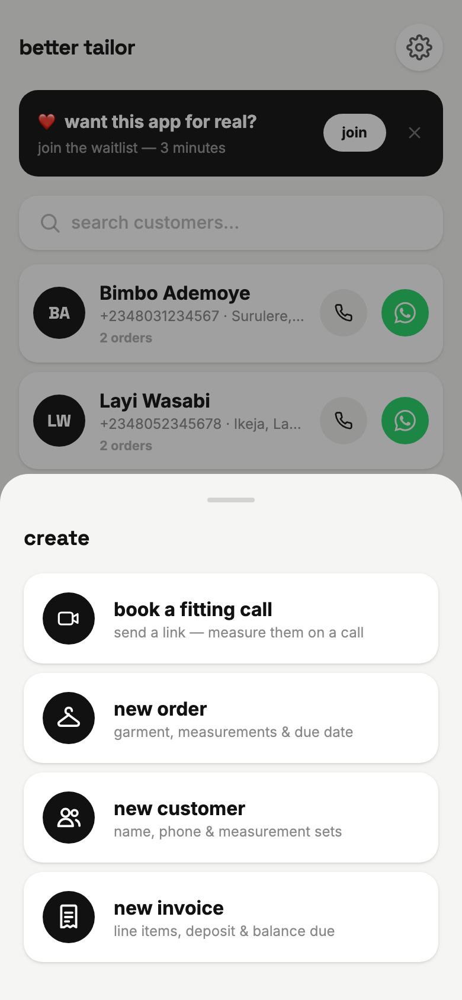 | 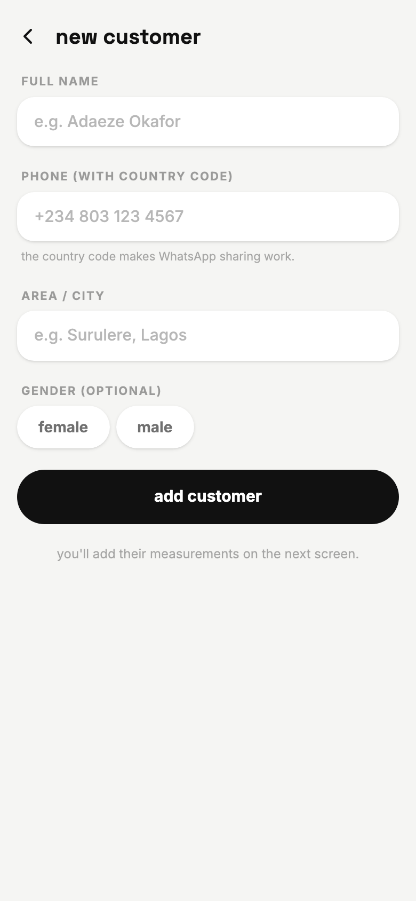 |  |
| **03** — The `+` sheet. `new customer` is one of four entry points. | **04** — Four fields, one of them optional. Name is the only requirement. | **05** — Gender is a two-chip toggle and re-tapping clears it, because it only sorts the template list later. |

The hint under the phone field — *"the country code makes WhatsApp sharing
work"* — is load-bearing. `waPhone()` strips everything but digits and hands the
result to `wa.me/`, so a number saved without `+234` silently fails to open a
chat.

## 3. Measurements — the reason the record exists

Saving is deliberately a two-step: create the person, *then* attach their
numbers. The form ends with "you'll add their measurements on the next screen",
and the detail screen opens with an empty measurements block asking for exactly
that.

| | |
|:--|:--|
| 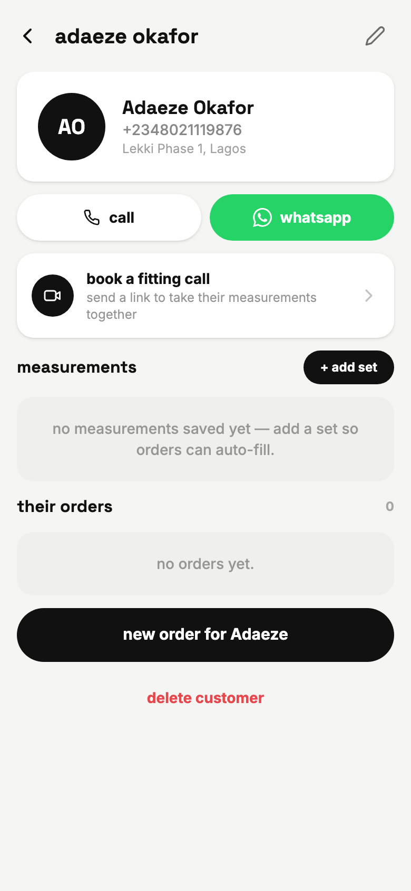 | 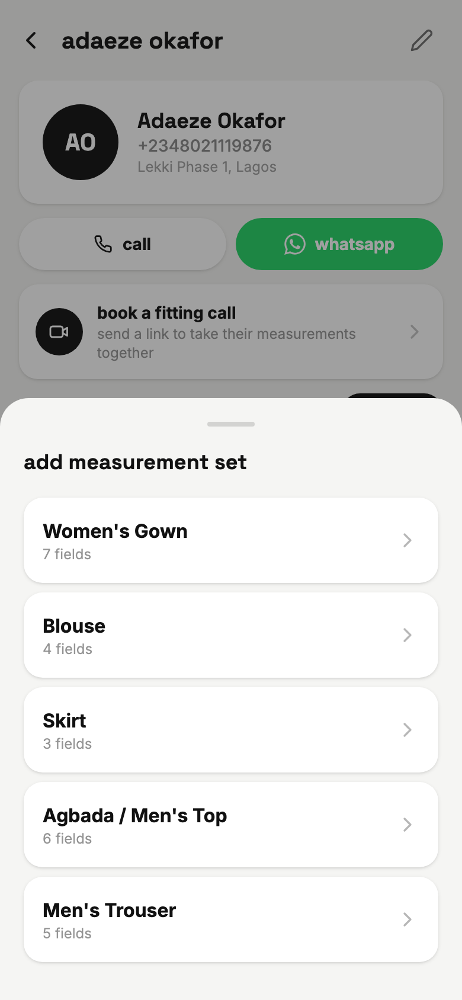 |
| **06** — A fresh record. The measurements block says what it is *for*: "add a set so orders can auto-fill." | **07** — Templates the customer doesn't have yet. Gender puts the likely ones on top — this customer is female, so Gown / Blouse / Skirt sort above the men's templates. |

| | | |
|:--|:--|:--|
| 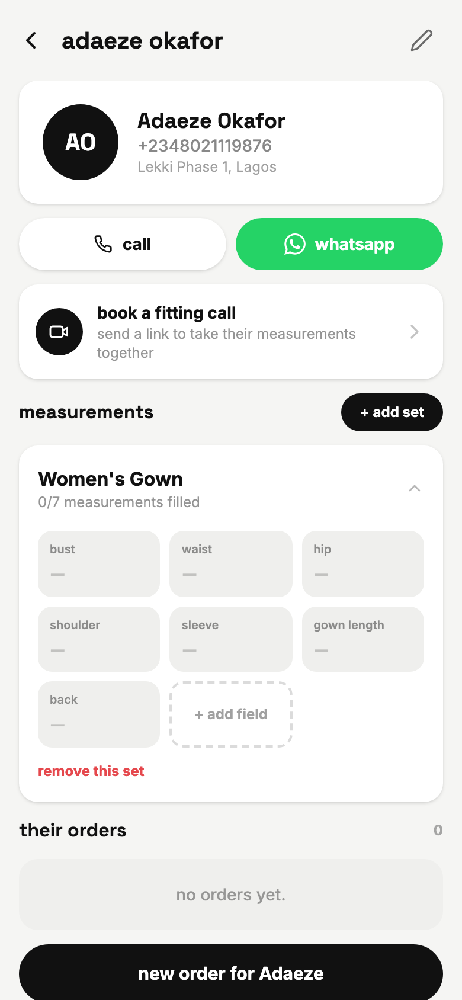 |  | 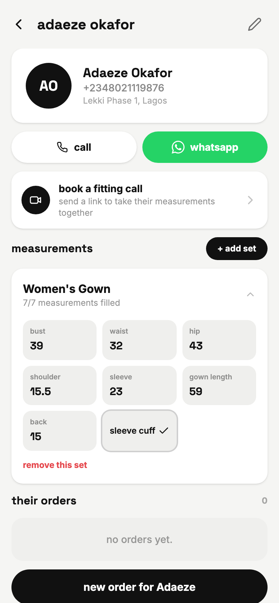 |
| **08** — A newly attached set opens expanded, every field blank. The header counts `0/7 filled`. | **09** — Filled. Values are free-text-with-numeric-intent, so `15.5` and a written note both survive. | **10** — `+ add field` for the measurement this tailor takes that the template doesn't name. Enter or blur commits it. |

## 4. An established customer

| | |
|:--|:--|
| 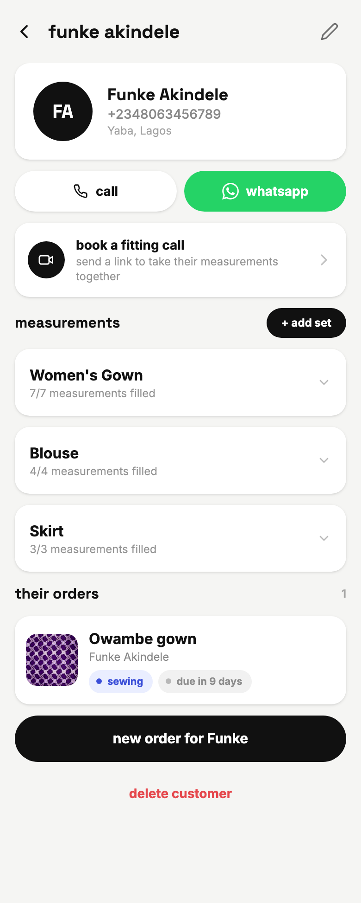 | 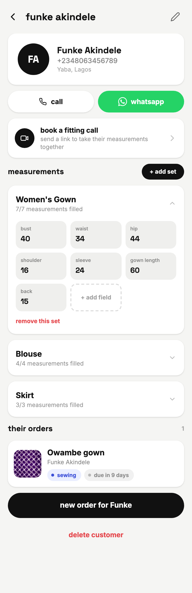 |
| **11** — Three saved sets, collapsed to their fill counts, plus every order this customer has ever placed. | **12** — One set open at a time. Opening a second collapses the first. |

## 5. What the record is *for*

Two buttons at the ends of the detail screen turn a saved customer into work.
Both carry the customer through, so neither flow asks who it is for.

| | |
|:--|:--|
| 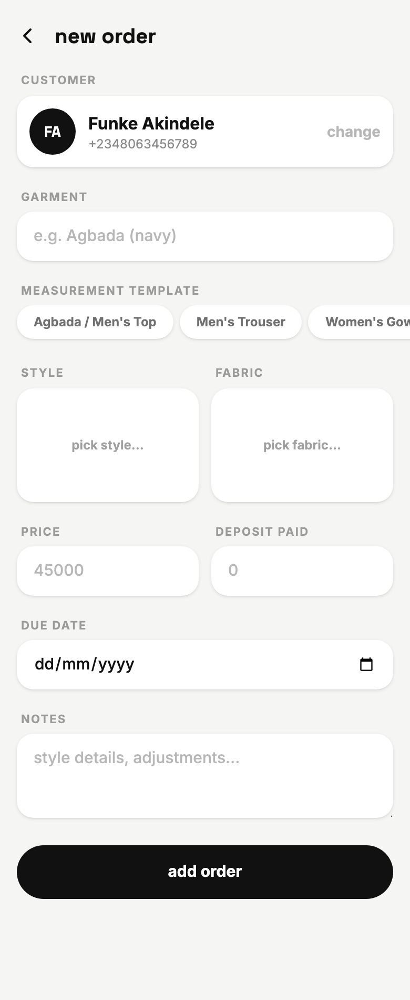 | 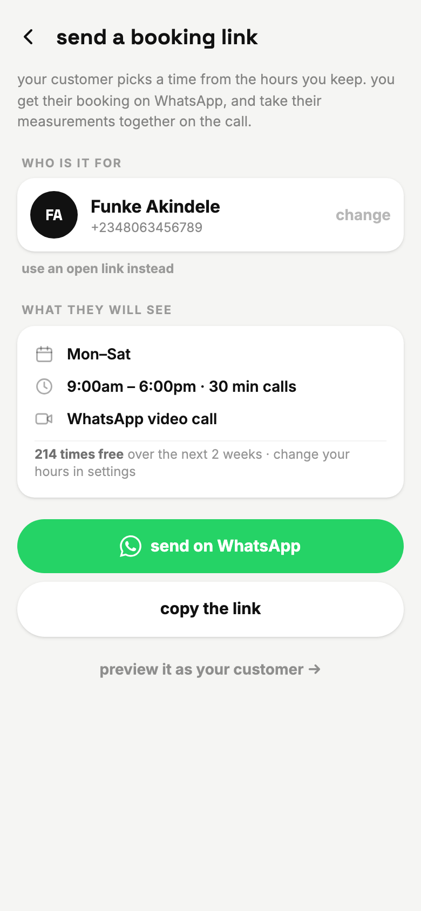 |
| **14** — `new order for Funke` opens the order form with the customer already chosen; only the garment is left to name. | **13** — `book a fitting call` opens the booking link addressed to them — for a customer whose numbers you don't have yet. |

## 6. Editing and deleting

| | |
|:--|:--|
| 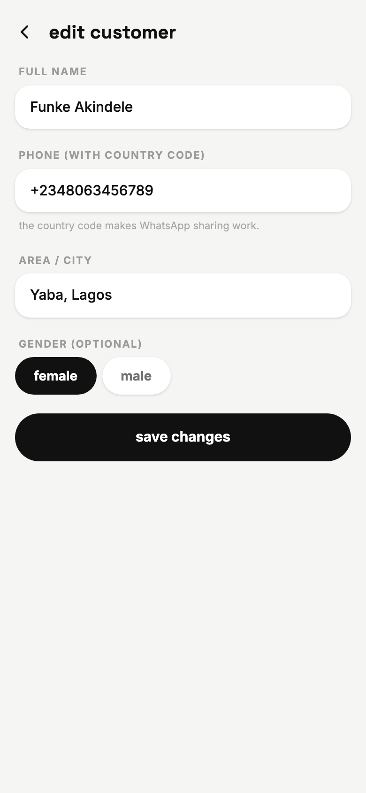 | 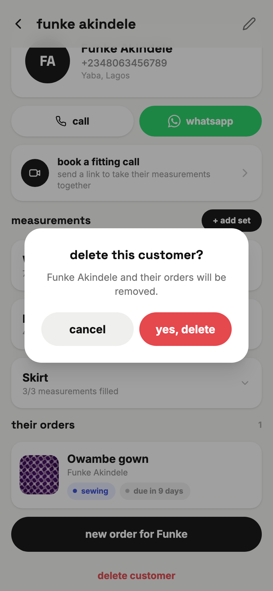 |
| **15** — Edit reuses the create form, prefilled. Measurements are not edited here — they live on the detail screen. | **16** — Delete **cascades to their orders**, and the dialog says so before you commit. |

## 7. Where customers show up elsewhere

These three frames belong to the Orders gallery, but they are the customer
feature doing its job, so they are reproduced here.

| | | |
|:--|:--|:--|
| 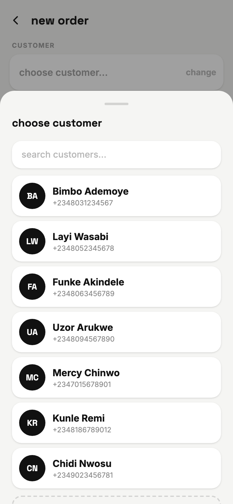 | 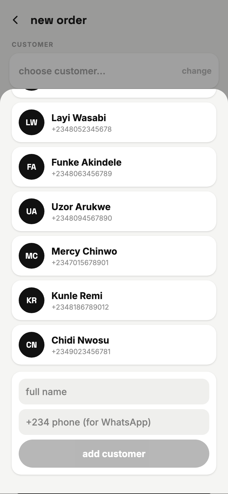 | 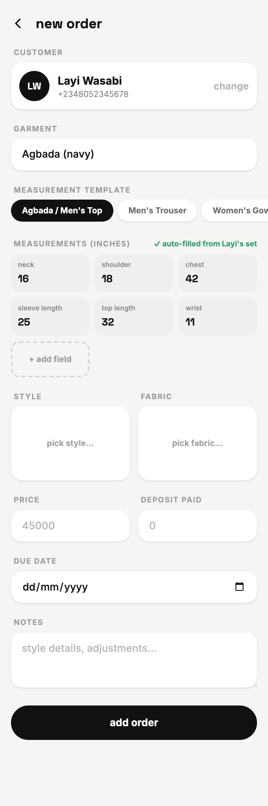 |
| **18** — The picker inside the order form: the same list, same name-only search. | **19** — Quick-add: name and phone, no area, no gender. A walk-in should not cost you the order you were writing. | **20** — The payoff. Pick a customer and a template, and the saved set copies into the order — `✓ auto-filled from Layi's set`. |

---

## Rules worth knowing

| Rule | Behaviour |
|---|---|
| **Snapshot, not reference** | Measurements copied into an order are **copied**. Editing them on the order never rewrites the customer's saved set, so last month's agbada keeps the numbers it was actually cut to. |
| **One set per template** | A customer holds at most one measurement set per template. Templates already attached don't appear in the add sheet; when all are attached it reads "all templates already added." |
| **Gender only sorts** | Gender never filters. A female customer can still be given the Men's Trouser template — it just sorts below the women's ones. |
| **Delete cascades** | `deleteCustomer` also removes every order with that `customerId`. Invoices and consultations are left alone. |
| **Name is the only required field** | Phone, area, and gender are all optional. A customer with no phone loses the call and WhatsApp buttons entirely rather than showing dead ones. |
| **Avatar is derived** | Initials come from the first two words of the name. There is no photo field anywhere in the customer model. |

## Data captured here

The seed data drives every frame above. Customers are stored newest-first and
persisted whole (`bt_data_v1` in `localStorage`), so a screenshot run always
starts from a cleared store to keep the list identical between captures.
