# Invoices — screen gallery

Every screen and state in the Invoices feature, captured from the running app at
390×844 @2x. No mockups — each frame came from driving the real UI.

Orders answer "what am I sewing?"; invoices answer "who still owes me?". The
feature exists to turn work a tailor has already done into a thing they can send
down a WhatsApp thread in two taps. The build spec for porting this to native iOS
and Android is [ADR 0004](../../adr/0004-invoices-feature.md).

---

## 1. The list

One row per invoice: number, customer, date, **total**, and a status pill. The
big number is the invoice total, not the balance — the list is a ledger, and the
balance lives one tap away on the invoice itself.

| | |
|:--|:--|
| 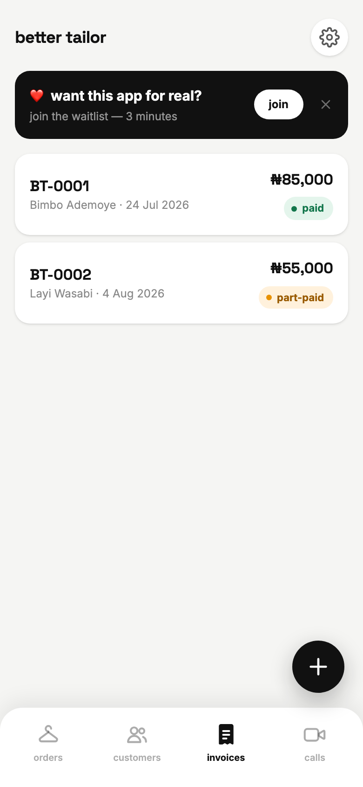 | 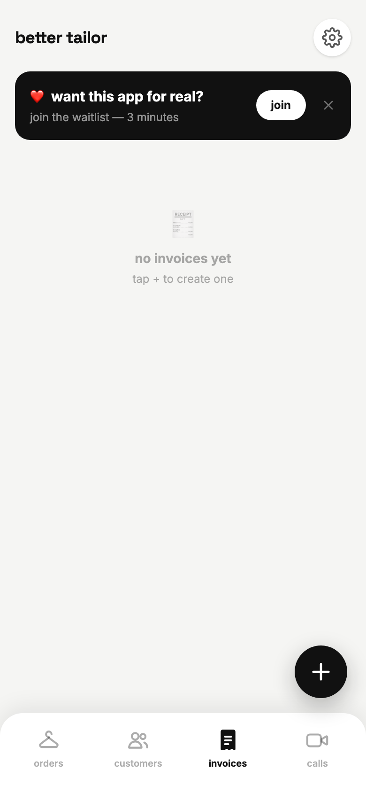 |
| **01** — `BT-0002` reads ₦55,000 (₦60,000 less a ₦5,000 discount) while its balance is ₦25,000. | **16** — Empty state points at the `+` that resolves it. |

## 2. Creating an invoice

`new invoice` is the fourth entry in the create sheet, and the only one that
starts by asking who rather than what — the customer picked here decides which
orders can be billed.

| | |
|:--|:--|
| 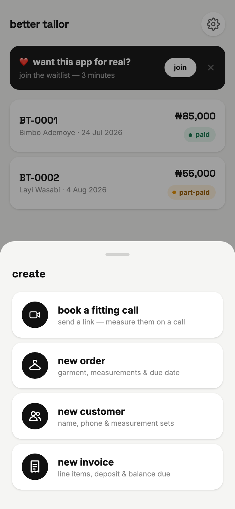 | 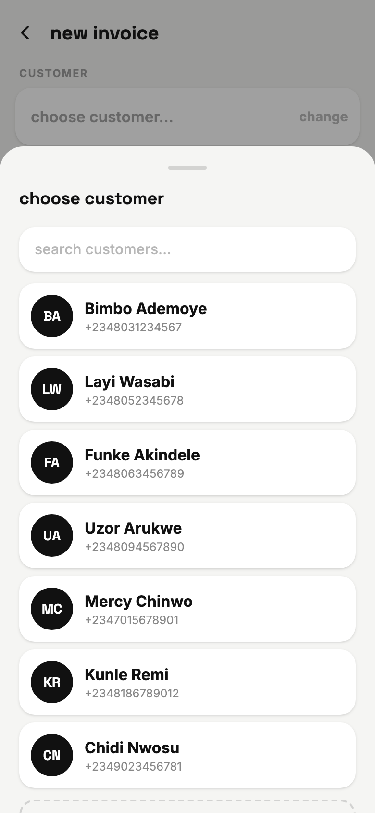 |
| **04** — The create sheet, shared with orders and customers. | **05** — The picker opens *by itself* on a blank invoice. Nothing on the form works without it. |

## 3. Billing orders — the step that earns the feature

This is the whole point. A tailor never retypes what they already recorded: tick
the garments and each becomes a line item at its order price. Ticking also
auto-sums the deposits already collected against those orders, so the balance is
right without arithmetic. The deposit field stays editable — touch it once and
the auto-sum stops fighting you.

| | |
|:--|:--|
| 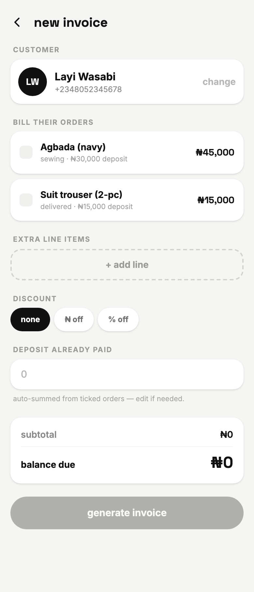 | 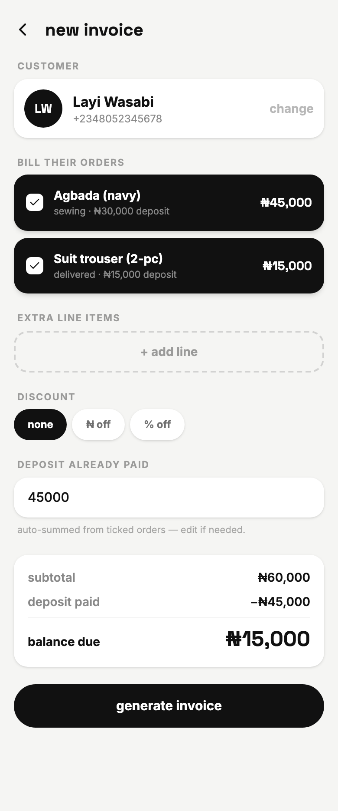 |
| **06** — Layi's two orders, untouched. Subtotal ₦0, `generate` is disabled. | **07** — Both ticked: subtotal ₦60,000, deposit auto-summed to ₦45,000, balance ₦15,000. |

## 4. Everything an order doesn't cover

Fabric bought on the customer's behalf, an alteration, a delivery run — the
things that never became orders. Then a discount, flat or percentage, because
haggling is not an edge case here.

| | |
|:--|:--|
| 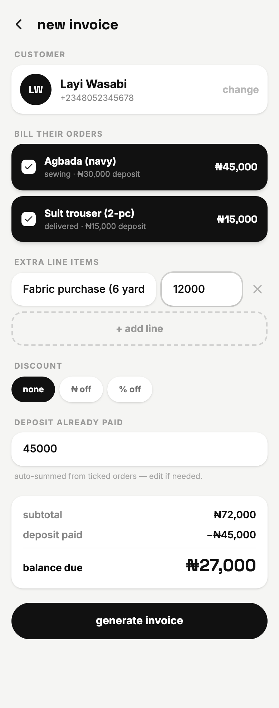 | 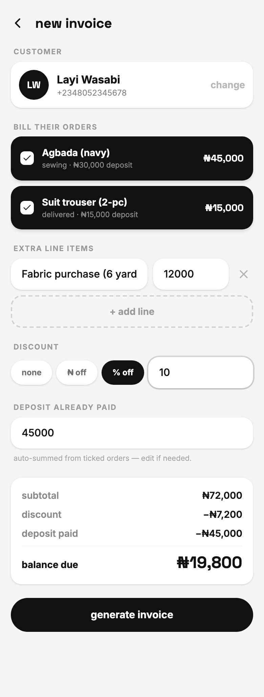 |
| **08** — A manual line: ₦12,000 of fabric. Subtotal moves to ₦72,000. | **09** — `10% off` → −₦7,200, balance ₦19,800. The summary card recomputes on every keystroke. |

The label takes whatever width is left; the amount is pinned at 112px. It is
sized with `flex-basis`, not `width` — `inputCls` already carries `w-full`, and a
`w-28` beside it loses the cascade, which is how this row first shipped with the
label squashed to a strip of padding.

## 5. The invoice itself

One card, built to be screenshotted. Business name, billed-to, lines, the
subtotal → discount → deposit ladder, and one number set larger than everything
else. The bank details block only renders when there is still something to pay.

| | | |
|:--|:--|:--|
| 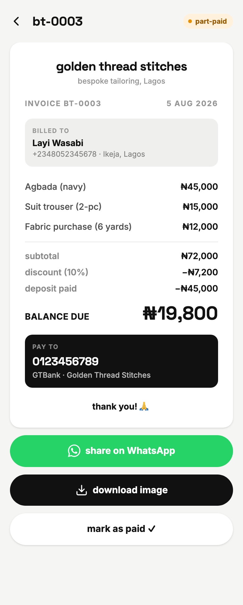 | 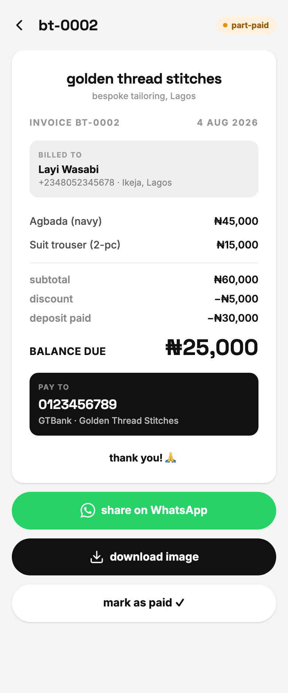 | 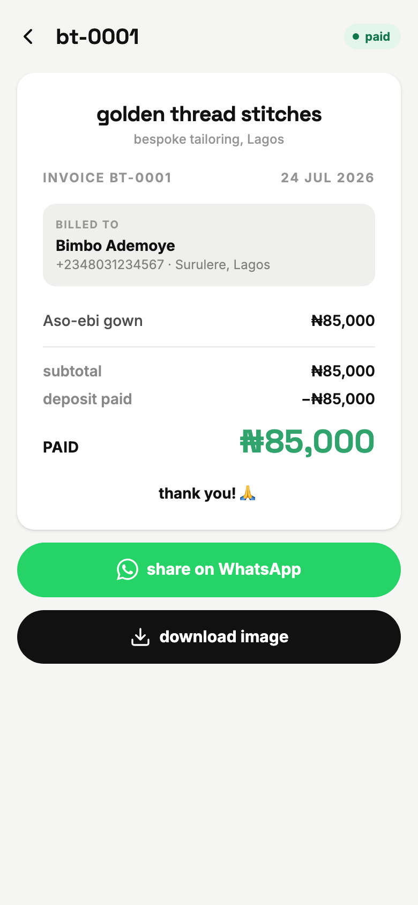 |
| **10** — `BT-0003`, generated from the draft above. Numbering is `BT-0001`, `BT-0002`, … | **02** — Part-paid: balance due in black, `pay to` block present. | **03** — Paid: the number turns green, the label becomes `PAID`, and `pay to` disappears — nothing left to collect. |

## 6. Getting it to the customer

Three actions, in the order a tailor uses them. WhatsApp opens a pre-composed
message on the customer's own number. `download image` renders the card through
html2canvas and saves it. `mark as paid` sets the deposit to the full total, so
the status derives to `paid` rather than being set by hand.

| | |
|:--|:--|
| 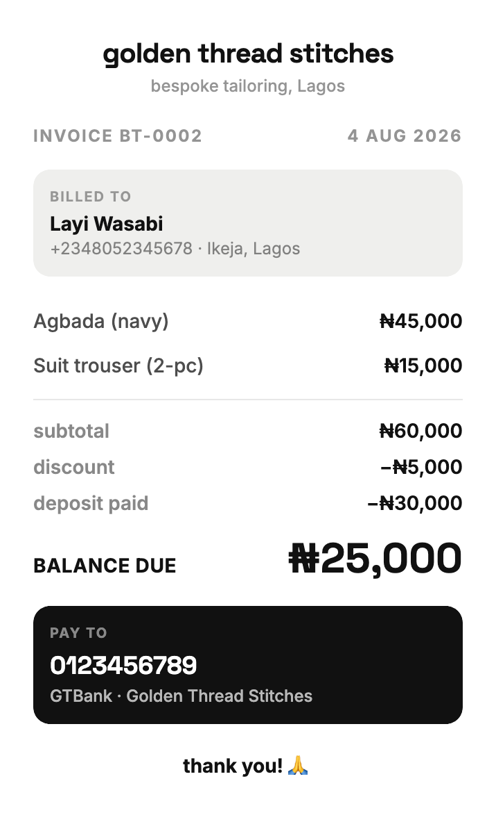 | 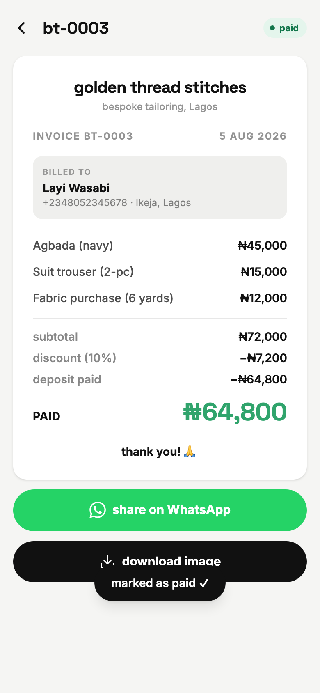 |
| **15** — The actual downloaded PNG, not a screenshot of it. White background, no app chrome, ready to send. | **11** — After `mark as paid`: header pill flips to `paid`, deposit line becomes the full ₦64,800. |

The WhatsApp message is plain text with `*bold*` markers, so it reads correctly
inside the chat rather than as a link to somewhere else:

```
*INVOICE BT-0002 — Golden Thread Stitches*
Billed to: Layi Wasabi
─────────────
Agbada (navy) ....... ₦45,000
Suit trouser (2-pc) ....... ₦15,000
Subtotal ....... ₦60,000
Discount ....... -₦5,000
Deposit paid ....... -₦30,000
*BALANCE DUE ....... ₦25,000*
─────────────
Pay to: GTBank 0123456789 (Golden Thread Stitches)
Thank you! 🙏
```

## 7. Coming in from an order

The far more common path than the `+` button: finish a garment, bill it from the
screen you're already on.

| | |
|:--|:--|
| 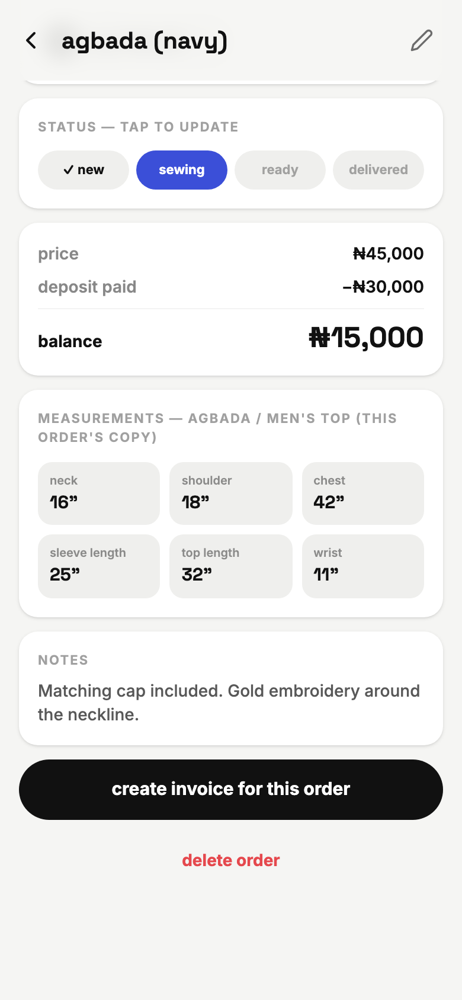 | 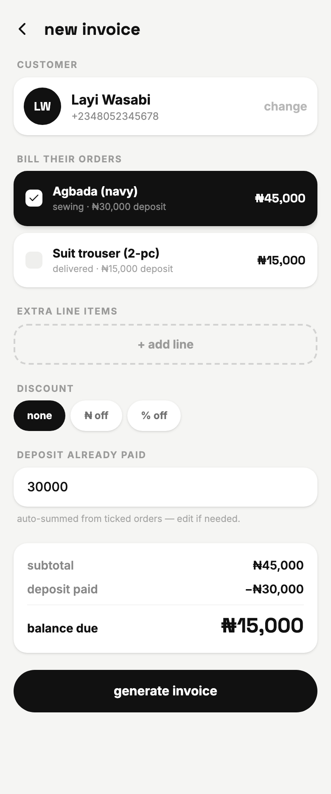 |
| **13** — Bottom of any order detail, above `delete order`. | **12** — Arrives with the customer set, that order ticked, its ₦30,000 deposit filled. One tap from done. |

## 8. The customer with nothing to bill

Booked through a fitting link, never ordered anything. The orders block explains
itself instead of showing an empty box, and `generate invoice` stays disabled
until a line exists.

| | |
|:--|:--|
| 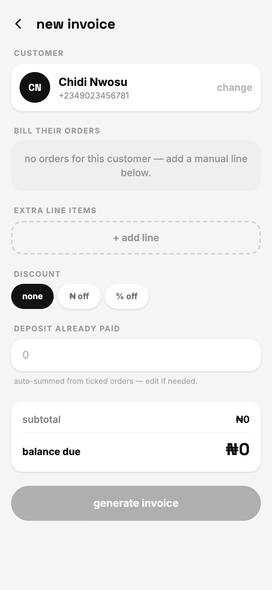 | |
| **14** — "no orders for this customer — add a manual line below." | |

---

## Status pills

Status is **derived from the money**, never set directly — there is no "mark
unpaid" anywhere in the UI.

| Pill | When |
|---|---|
| `paid` | Green. `total > 0` and `balance ≤ 0` |
| `part-paid` | Amber. Some deposit recorded, balance still above zero |
| `unpaid` | Grey. No deposit recorded |

## The money, in order

```
subtotal = Σ line amounts
discount = flat ? value : round(subtotal × value / 100)
total    = max(0, subtotal − discount)
balance  = max(0, total − depositPaid)
```

Both clamps matter: a discount larger than the subtotal must not produce a
negative total, and an over-payment must not produce a negative balance. Rounding
happens once, on the percentage discount only.
