# Multi-staff access control — screen gallery

Every screen in the multi-staff prototype, captured from the running app on an
iPhone-sized viewport (390×844 @2x). No mockups — each state was produced by
driving the real UI.

The design rationale, the full role matrix and what it would take to build this
for production live in [ADR 0001](../../adr/0001-multi-staff-access-control.md).

---

## 1. The solo shop — nothing changes

The app ships with one owner and no PIN. A first-time visitor sees exactly what
they saw before the feature existed; the lock screen only appears once a second
person is added. This keeps the public demo's conversion funnel intact.

| | |
|:--|:--|
|  | 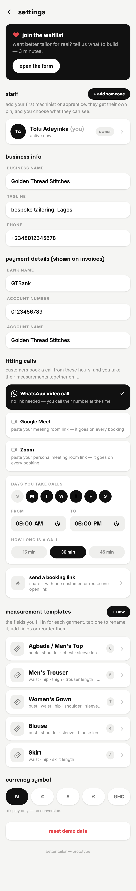 |
| **01** — Four tabs, `+` button, `₦126k unpaid`. Identical to the pre-feature app. | **02** — Settings, solo. The staff section invites the first hire. |

## 2. Hiring and grading a teammate

Roles carry their consequences in the option itself, so the boss picks by
reading what changes rather than guessing what the word means. A new hire gets
a working 4-digit PIN on creation — nobody exists in a "tap straight through"
state.

| | |
|:--|:--|
| 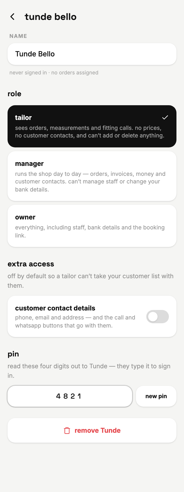 | 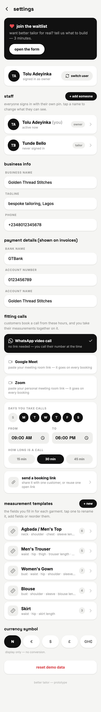 |
| **03** — Role picker, the single `customer contact details` override, and the PIN. | **04** — Roster with a `(you)` marker, role pills, last-active and current workload. |

## 3. Assigning work

`assignedTo` on the order, plus a `mine` filter chip. The picker shows each
person's open load so the boss spreads work instead of piling every rush job on
whoever is top of the list.

| | | |
|:--|:--|:--|
| 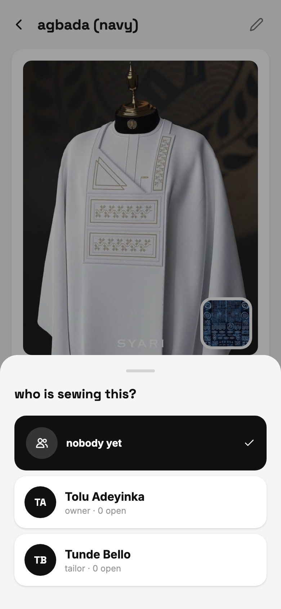 | 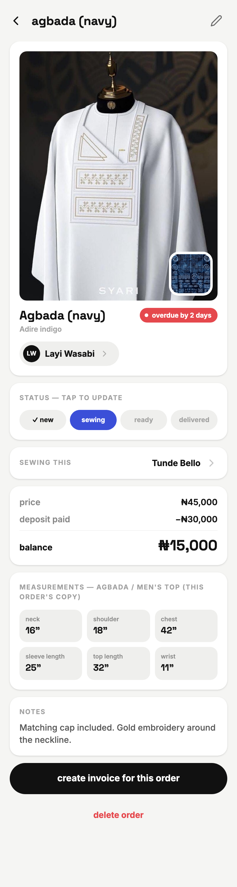 | 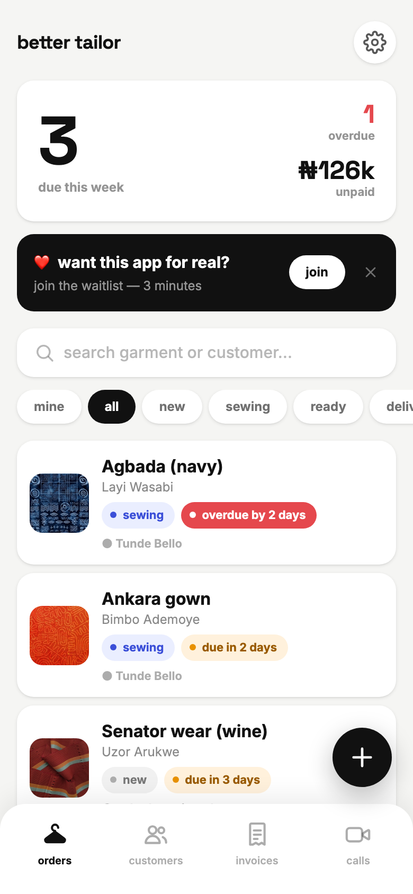 |
| **05** — "who is sewing this?" with per-person open counts. | **06** — Order detail as owner: assignee row and real prices. | **07** — Orders list with the `mine` chip and per-card assignment. |

## 4. Signing in

A shared counter phone asks *who*, not *what's the password*. The owner may go
PIN-less — a forgotten PIN in a local-only app has no reset path, and nobody
should be locked out of their own shop.

| | | |
|:--|:--|:--|
| 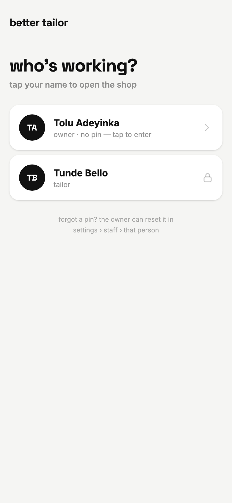 | 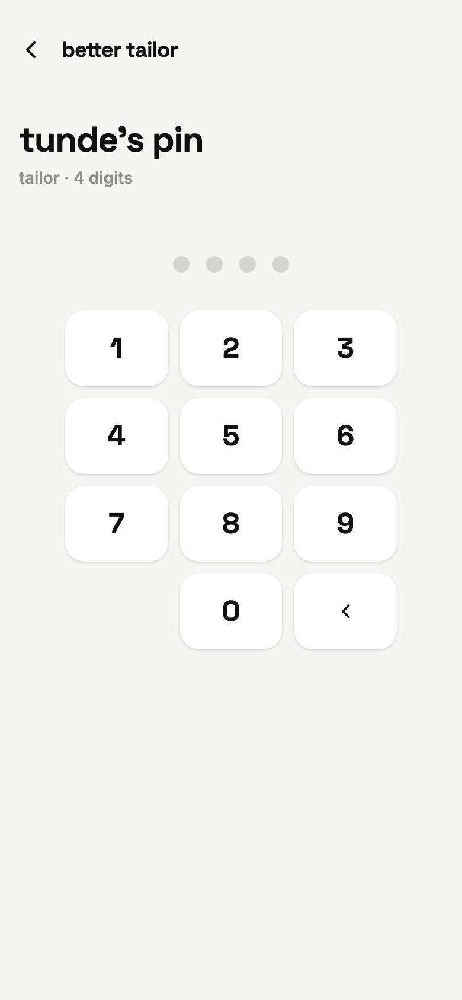 | 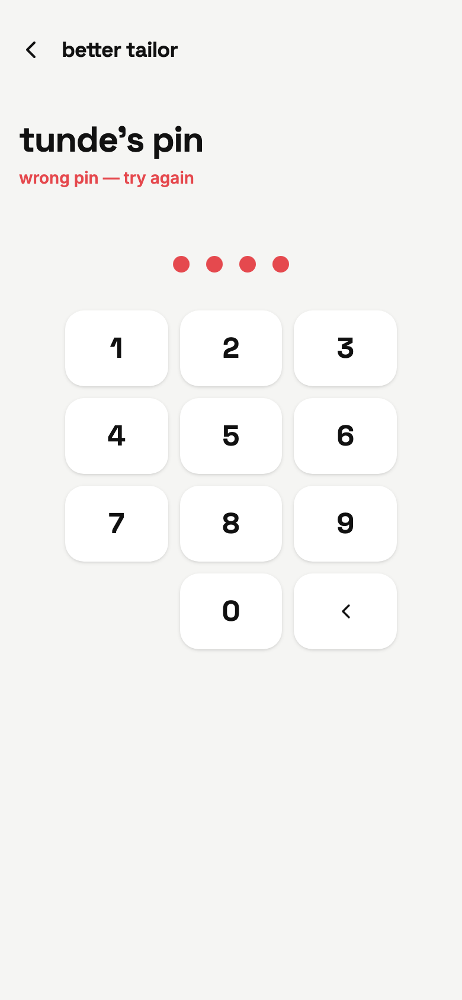 |
| **08** — Owner is PIN-less; the tailor carries a padlock. | **09** — The PIN pad. | **10** — Rejected: red dots, then it clears itself. |

## 5. What a tailor sees

The gate a customer actually asked for. A tailor sews: they get orders,
measurements and fitting calls, and nothing that would let them walk off with
the customer book.

| | | |
|:--|:--|:--|
| 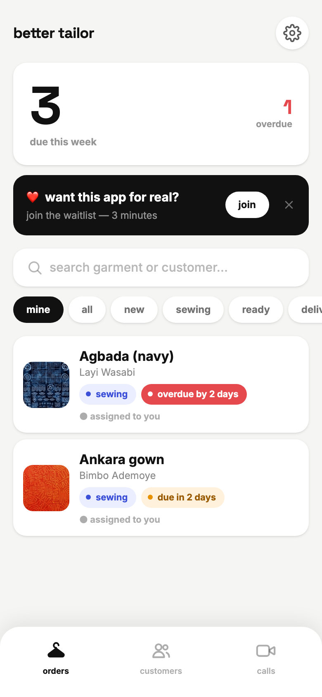 | 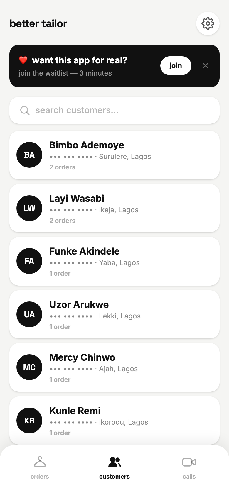 | 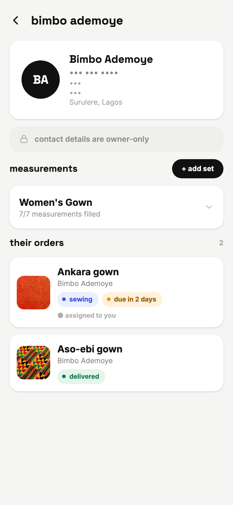 |
| **11** — Three tabs (invoices gone), no `+`, no unpaid figure, `mine` pre-selected. | **12** — Every phone masked. Areas stay readable — you can't poach with a neighbourhood. | **13** — Phone, email and address masked; no call or WhatsApp button. |

| | |
|:--|:--|
| 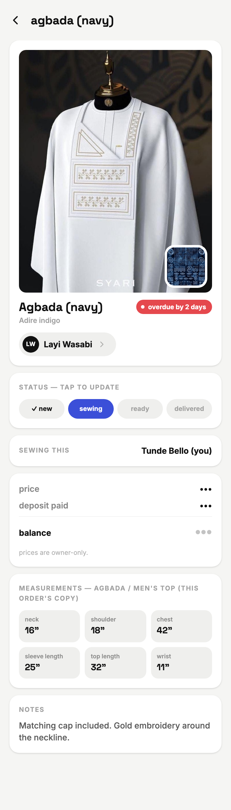 | 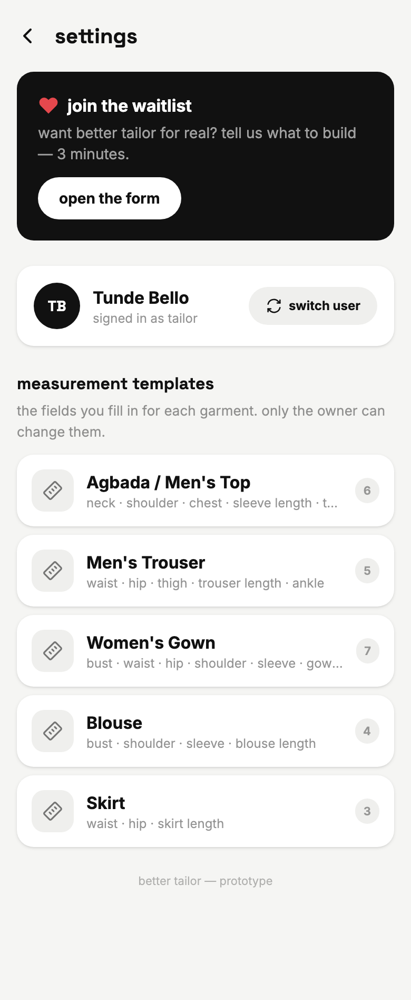 |
| **14** — Price, deposit and balance are `•••`; measurements are fully intact. | **15** — Settings: switch user and read-only templates. No bank details, no staff. |

## 6. The override

One switch, per person. The comparison worth showing a prospect is **13 vs 16**
— same person, same screen, one toggle.

| | |
|:--|:--|
|  | 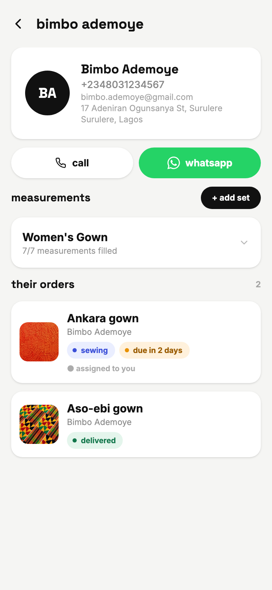 |
| **13** — Override off (the default). | **16** — Override on: contacts and buttons return — but editing, deleting and prices stay locked. |

## 7. The manager role

Runs the shop day to day. Everything except hiring and the bank details.

| | |
|:--|:--|
| 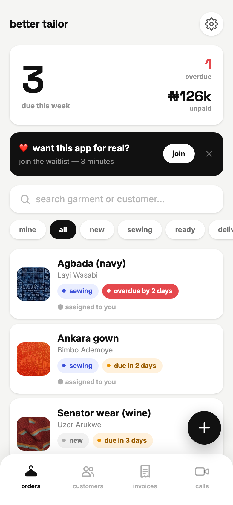 | 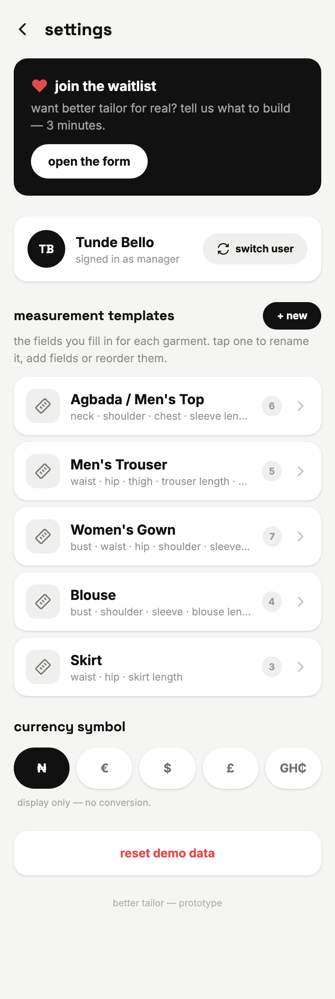 |
| **17** — Invoices tab and the unpaid figure are back. | **18** — No staff section, no business info, no payment details. |

---

## A caveat these images cannot show

The masking is real in the sense that hidden values never reach the rendered
DOM — but this is a `localStorage` prototype with no server. Anyone who opens
devtools can read the raw store. **This demonstrates the interaction design, not
enforceable security.** Making it real is the whole subject of
[ADR 0001 §6](../../adr/0001-multi-staff-access-control.md#6-what-production-actually-requires).
