# Onboarding — screen gallery

Every screen and state in the Onboarding feature, captured from the running app
at 390×844 @2x. No mockups — each frame came from driving the real UI.

Onboarding is three screens between opening the app for the first time and the
orders list. The first two are a value pitch and shop details. The third is the
one this feature is really about: **it asks the tailor what she measures, and
lets her say it in her own words before she has entered a single customer.**
The build spec for porting this to native iOS and Android is
[ADR 0006](../../adr/0006-onboarding-templates.md).

---

## 1. The pitch

One screen, no step counter — the counter only appears once she has committed by
tapping through. Three claims, each one a thing the app actually does.

| |
|:--|
| 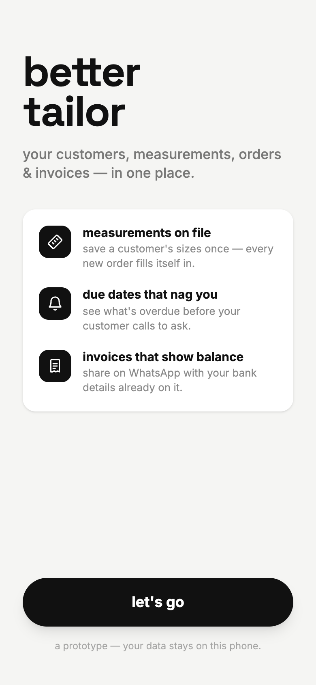 |
| **01** — The three features map to the three galleries next door: measurements ([customers](../customers-feat/)), due dates ([orders](../orders-feat/)), balance ([invoices](../invoices-feat/)). The footer is the honest disclaimer — `a prototype — your data stays on this phone.` |

## 2. Shop details

Two fields and a live preview of what they buy her. The preview is the point:
the payoff for typing a shop name is visible before she commits to it.

| | | |
|:--|:--|:--|
|  | 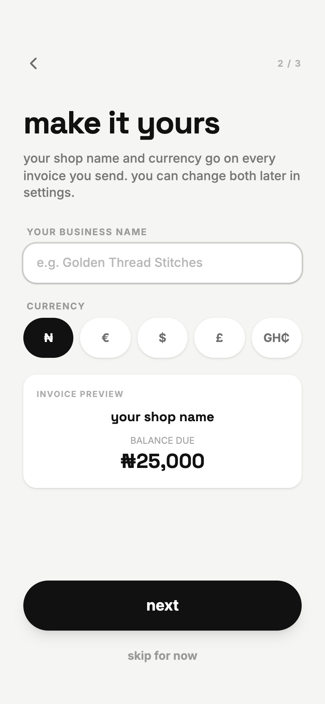 | 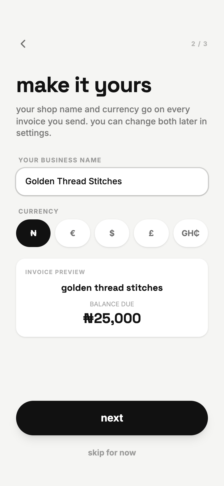 |
| **02** — How step 2 actually arrives in this build: the demo seed already wrote `businessName`, so the field is prefilled rather than empty. A native port that ships without seed data lands on **03** instead. | **03** — The designed empty state. Placeholder in the field, and the preview falls back to `your shop name` rather than rendering a blank header. | **04** — Typed. The preview header is `lowercase` by CSS only — the stored value keeps the capitals she typed. |

| |
|:--|
| 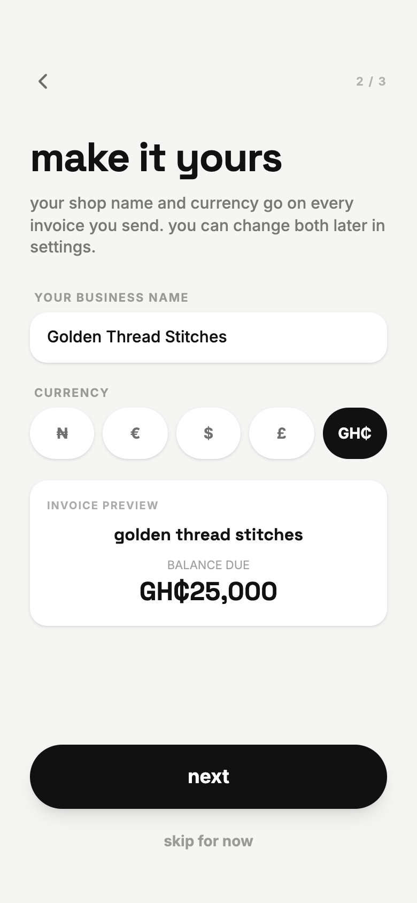 |
| **05** — Five currencies, equal-width cells so the three-character `GH₵` doesn't stretch its pill out of step. Picking one reformats the preview immediately — `₦25,000` becomes `GH₵25,000`. |

**`skip for now` on this screen is not a no-op.** It still saves the currency;
it only declines to save the name. Both exits go to step 3.

## 3. What do you measure?

The last thing onboarding does, and the reason the feature exists. A tailor does
not measure garments the way the app's authors guessed, so this screen does not
offer our five shipped templates as tick-boxes — **she builds from scratch.**
The suggestion chips are there so that "from scratch" doesn't mean typing
fourteen words on a phone keyboard.

| | | |
|:--|:--|:--|
| 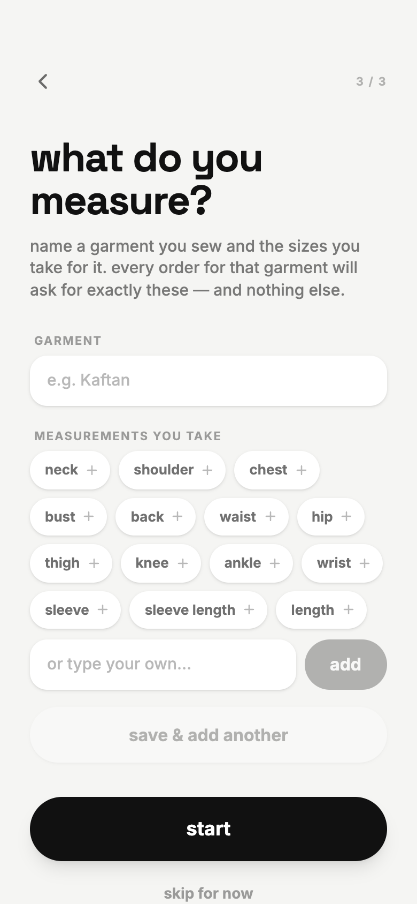 | 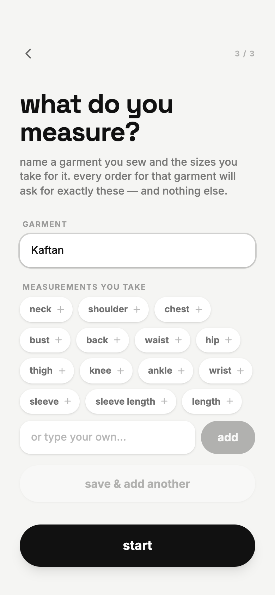 | 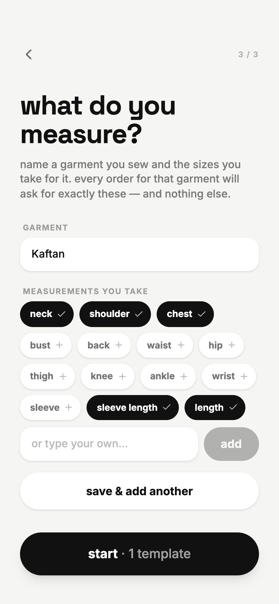 |
| **06** — Untouched. Fourteen generic suggestions, all off. `save & add another` is disabled, and `skip for now` is offered under `start` — this is the only state in which it is (contrast **13**). | **07** — A garment name alone is not enough. The save button stays disabled until there is a name *and* at least one field. | **08** — Chips toggle in place, `+` → `✓`, so a chip never moves under the thumb that just tapped it. Save is now live. |

| | |
|:--|:--|
| 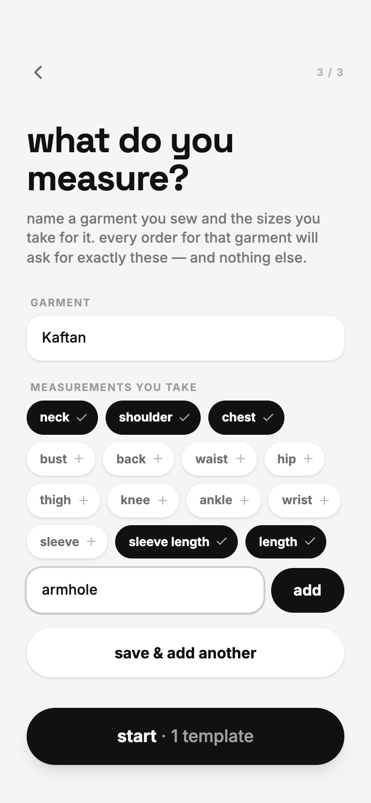 | 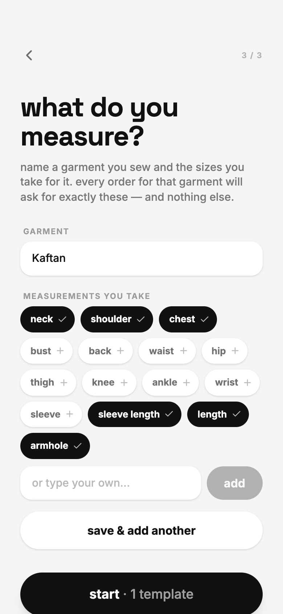 |
| **09** — The escape hatch for the measurement this tailor takes that we didn't think of. `add` enables on the first non-space character; Enter commits too. Note `start · 1 template` already — see below. | **10** — `armhole` joins the same chip row as the suggestions, removable exactly the same way. Custom names are lowercased on commit; garment names are not. |

Both **09** and **10** read `start · 1 template` with **nothing saved yet** — the
count includes the open form, so it always matches what tapping `start` will
actually do. That is the draft-fold rule (below) made visible.

### Building a list

Saved garments stack above the form, and the form below resets to blank for the
next one.

| | | |
|:--|:--|:--|
| 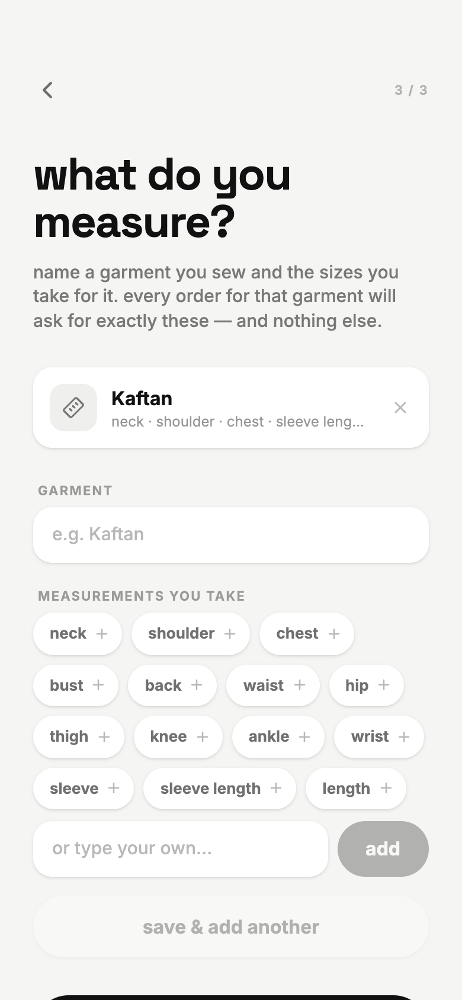 | 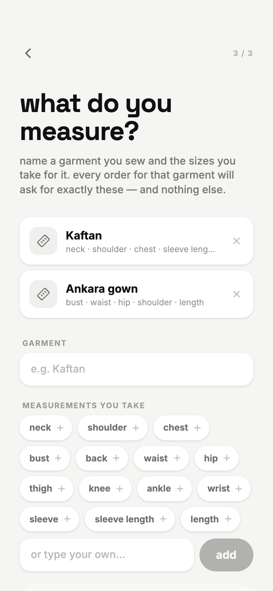 | 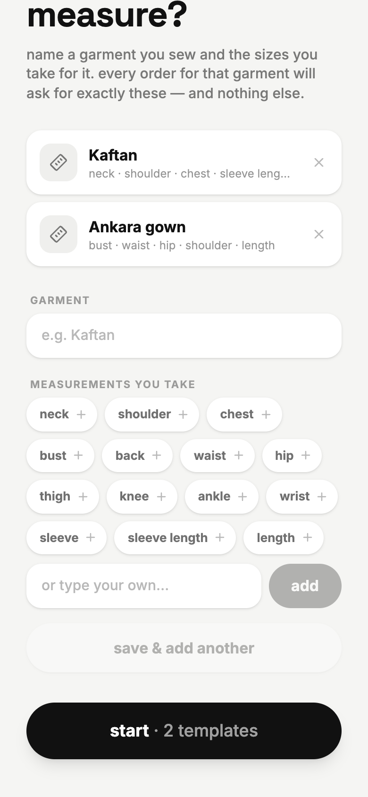 |
| **11** — One saved, and the form below has reset to blank for the next garment. | **12** — Two. Each card shows its fields joined with `·` and truncated. | **13** — The foot of **12**. `start · 2 templates`, and **no `skip for now` under it** — a skip sitting beneath two saved garments would be lying about what it does. |

| | |
|:--|:--|
| 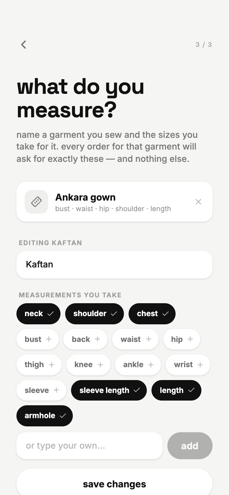 | 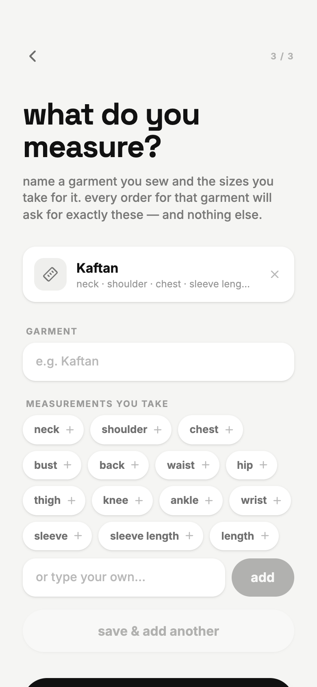 |
| **14** — Tapping a card loads it back into the form. The label changes to `editing Kaftan`, the button to `save changes`, and the card leaves the list while it is open — one copy, never two. | **15** — `×` removes a card with **no confirmation dialog** and no undo. Compare with **11**: the state is restored exactly. Nothing has been persisted yet, so there is nothing to be careful about. |

## 4. Going back

| |
|:--|
|  |
| **16** — Back from step 3 returns to step 2 with the name and currency still there. Drafted templates survive the round trip too — they live in component state until `start`, so stepping back writes nothing and loses nothing. |

## 5. What onboarding leaves behind

| | |
|:--|:--|
| 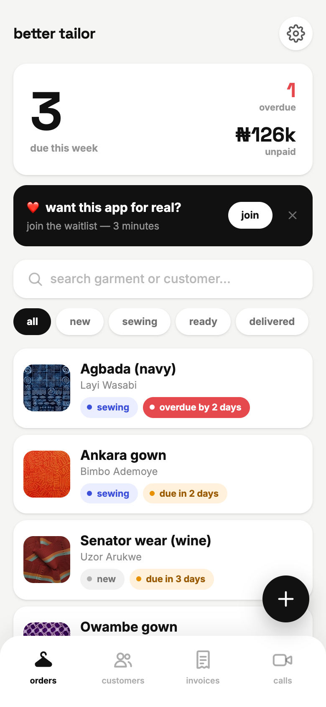 |  |
| **17** — `start` sets the first-run flag and lands on orders. Every later launch skips onboarding entirely. | **18** — Her `Kaftan` sits **above** the five shipped templates, carrying 6 fields — the five she picked plus the custom `armhole`. `addTemplates` prepends. |

| |
|:--|
| 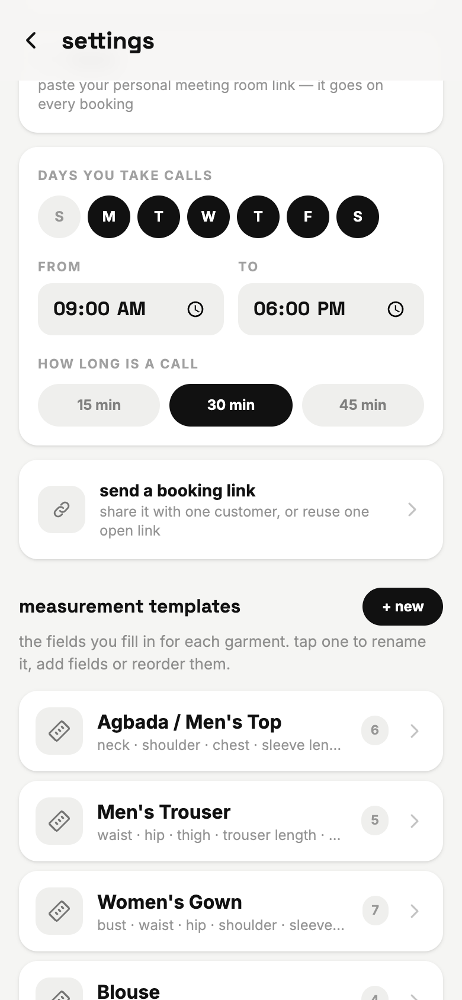 |
| **19** — The skip path, from a clean install: no template of her own, and the five shipped ones are all that's there — `Agbada / Men's Top` now at the top where `Kaftan` was. Skipping removes nothing; it only declines to add. |

---

## Rules worth knowing

| Rule | Behaviour |
|---|---|
| **Nothing persists until `start`** | Drafted templates live in component state. Going back to step 2, or closing the tab, leaves the store exactly as it was found. Only `start` calls `addTemplates`. |
| **The open form counts** | Every exit from the form folds it into the draft list first, so a garment she can still see on screen is never silently dropped — including by tapping `start` with the form half-filled. |
| **Emptying an edited card deletes it** | Clearing the name or all the fields of a card being edited removes it from the list rather than saving an empty template. |
| **`skip` only appears when there is nothing to skip** | Step 3 offers `skip for now` only while drafts are empty *and* the garment field is empty *and* no chip is on. |
| **Step 2's skip still saves currency** | `skip for now` on step 2 declines the name only. Currency is written either way. |
| **Name seeds two fields** | `next` writes the name to both `businessName` and `accountName`. Small shops bank under their trading name, and otherwise the invoice header and its "pay to" block disagree straight out of onboarding. |
| **Suggestions are not the shipped templates** | The 14 chips are deliberately generic (`neck`, `waist`, `length`). Garment-bound names from the seed — `gown length`, `trouser length` — are noise when defining a kaftan, so they're excluded. |
| **Her templates sort first** | `addTemplates` prepends, so what she just defined is at the top of the settings list, not buried under our five. |
| **The gate is one flag** | `bt_seen_welcome` in `localStorage`. Present → redirect to `/orders`. Only leaving step 3 sets it — by `start` or by `skip for now`. Step 2's skip does not; it just advances. |
| **Analytics are namespaced** | `onboard/template-added` fires once *per template*, so the event count answers "how many do tailors define at signup?". `onboard/templates-skipped` fires on the skip path. `opened` fires once either way and stays the comparable funnel baseline. |

## Data captured here

Two passes, each starting from a cleared `localStorage` so the run is
repeatable: **01–18** walk the flow through to `start`, and **19** is a second
pass taking the skip path at both steps. Onboarding's own screens carry no seed
data beyond the prefilled shop name in **02**; frames **17–19** show the seeded
demo store underneath, which is what a first run of this prototype actually
lands in.

Two garments were defined for the capture — `Kaftan`
(neck · shoulder · chest · sleeve length · length · armhole) and `Ankara gown`
(bust · waist · hip · shoulder · length) — the second removed again at **15**,
which is why **18** shows one template of hers and not two. Frame **19** is a
second pass through the flow, skipping both steps.
