# Orders — screen gallery

Every screen and state in the Orders feature, captured from the running app at
390×844 @2x. No mockups — each frame came from driving the real UI.

Orders are the spine of better tailor: a tailor opens the app to answer "what am
I sewing today, and what's late?" The build spec for porting this to native iOS
and Android is [ADR 0002](../../adr/0002-orders-feature.md).

---

## 1. The list — the app's home screen

The dashboard strip answers the only three questions worth a glance: what's due
this week, what's already late, and how much money is still owed. Below it,
search and status filters over a card per order.

| | | |
|:--|:--|:--|
| 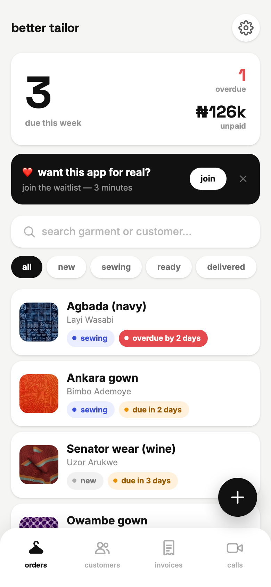 | 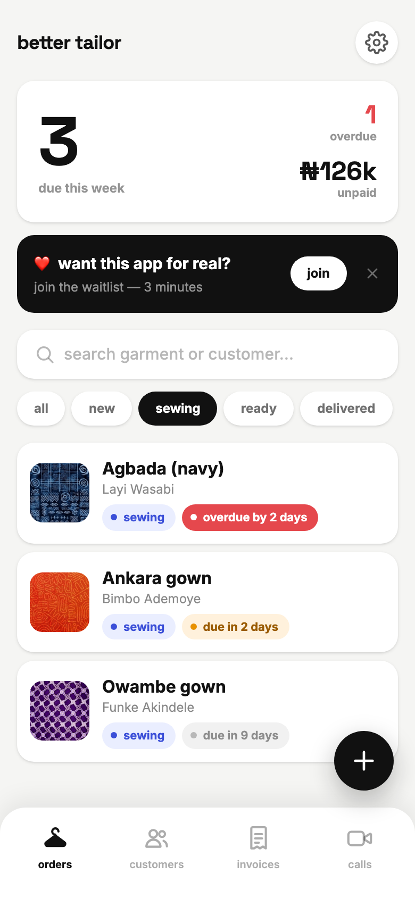 | 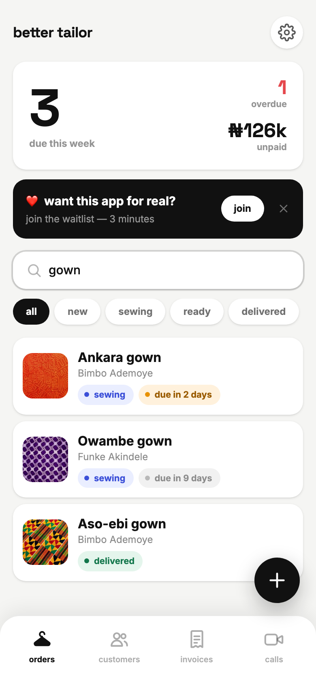 |
| **01** — Due-this-week is the biggest number on screen; overdue turns red only when non-zero. | **02** — Status filter. `all · new · sewing · ready · delivered`. | **03** — One search box matches garment *or* customer name. |

| | |
|:--|:--|
| 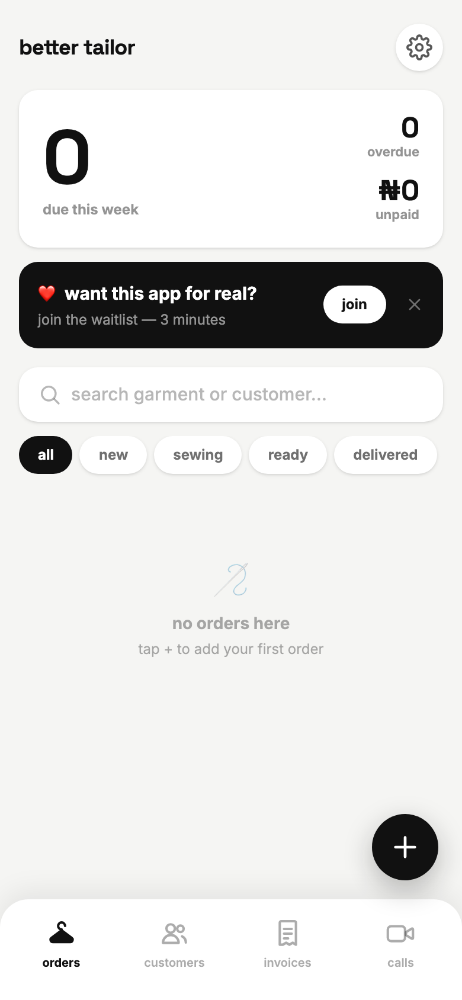 | |
| **17** — Empty state points at the one action that resolves it. | |

## 2. Creating an order

The `+` is a floating action button, deliberately clear of the tab row so it
reads as a primary action rather than a fifth tab.

| | |
|:--|:--|
| 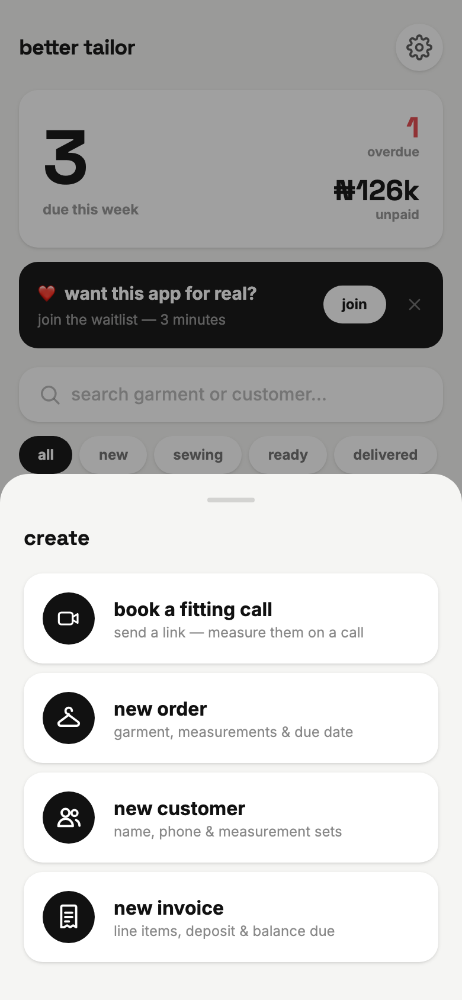 | 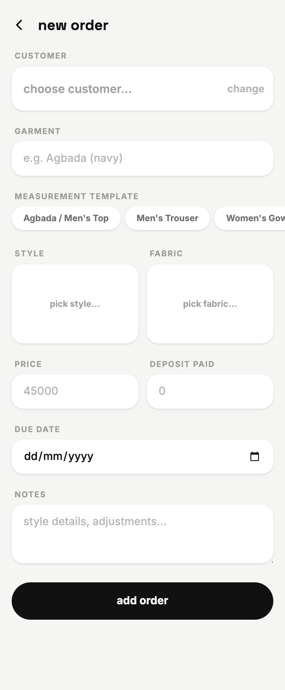 |
| **04** — The create sheet. Each row carries a subtitle saying what it produces. | **05** — A blank order. Customer first, because it drives the measurement autofill. |

## 3. Picking the customer

A tailor taking a walk-in should not have to abandon the order to create a
customer record, so the picker carries a two-field quick-add.

| | |
|:--|:--|
|  |  |
| **06** — Searchable customer list. | **07** — Quick-add: name and phone, then straight back to the order. |

## 4. Measurements — the autofill that earns the feature

Pick a template and the customer's saved set for that template copies in.
The green badge names whose numbers arrived, because a silent autofill is a
silent wrong-size risk. Values are **snapshotted onto the order**: editing them
here never rewrites the customer's saved set, so last month's agbada keeps the
measurements it was actually cut to.

| | |
|:--|:--|
|  | 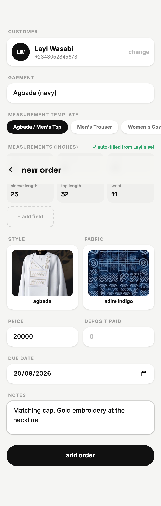 |
| **08** — `✓ auto-filled from Layi's set`, plus `+ add field` for a one-off measurement. | **11** — The complete form: style, fabric, price, deposit, due date, notes. |

## 5. Style and fabric

Photo grids rather than dropdowns. A tailor and a customer point at pictures;
neither of them thinks in SKU names.

| | |
|:--|:--|
| 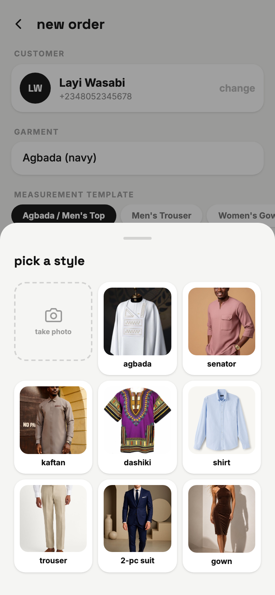 | 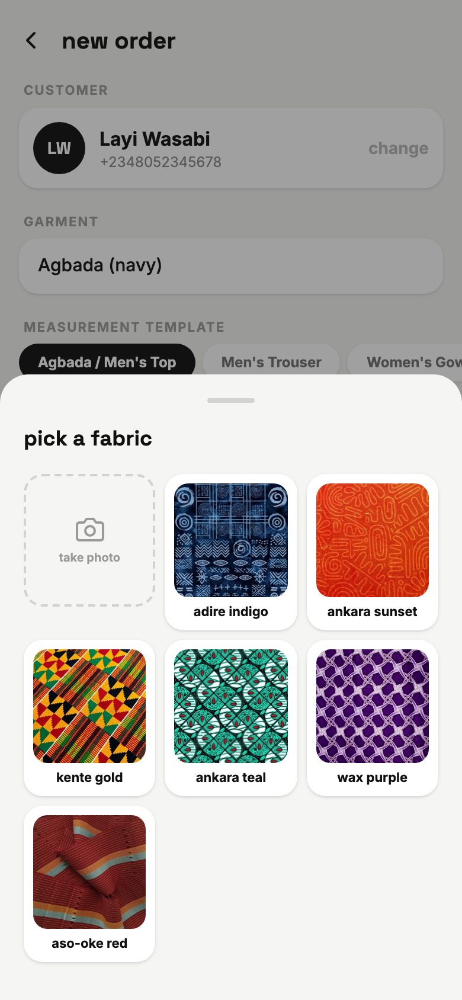 |
| **09** — Eight bundled styles. The dashed tile is the camera slot. | **10** — Six bundled fabrics, same grid. |

## 6. The order detail

One screen holds everything about a garment: what it looks like, where it is,
what's owed, and the numbers to cut to.

| | | |
|:--|:--|:--|
| 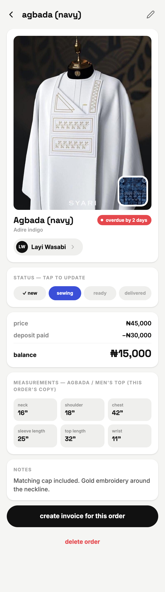 | 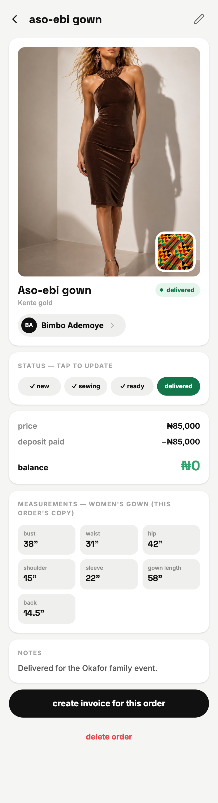 | 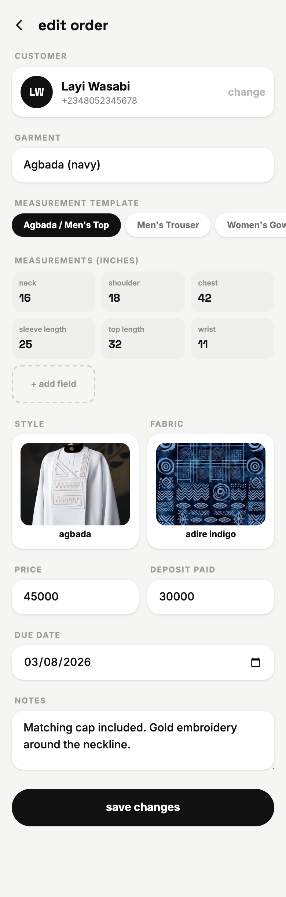 |
| **12** — Style photo with the fabric swatch inset, status stepper, money, measurements, notes. | **16** — Delivered: the due pill becomes a completion pill and stops nagging. | **13** — Edit reuses the create form, prefilled. |

## 7. Changing status, and destructive actions

| | |
|:--|:--|
| 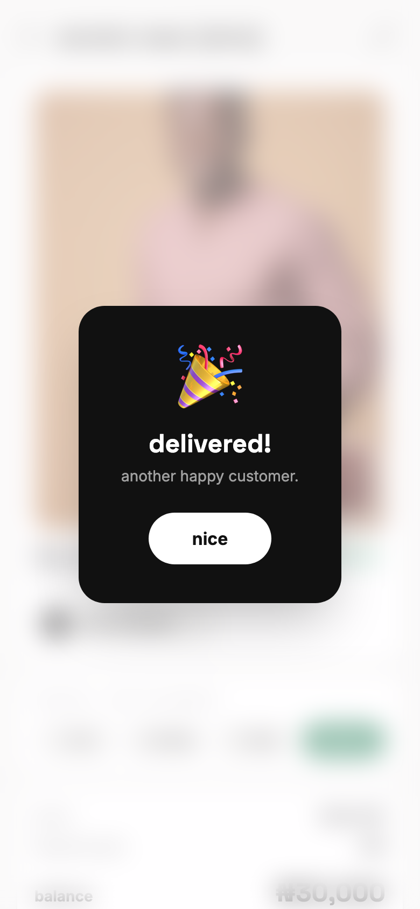 | 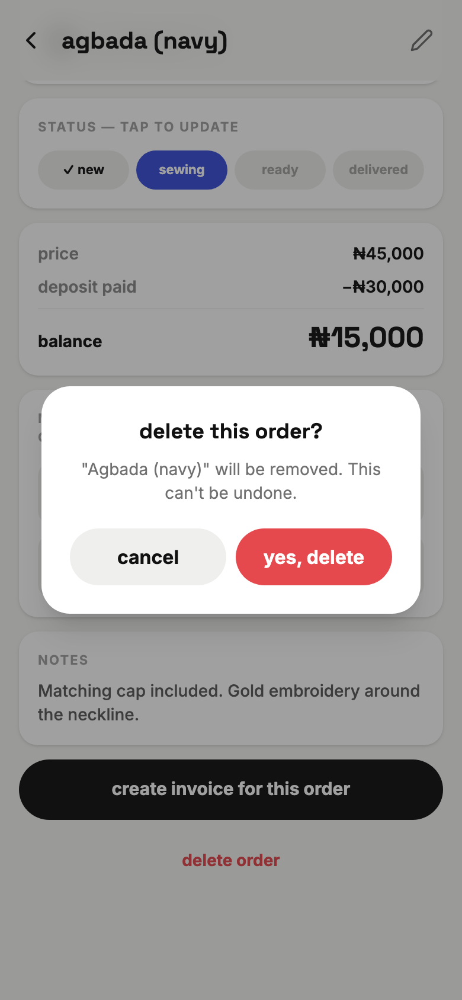 |
| **15** — Reaching `delivered` is the one moment the app celebrates. | **14** — Delete always asks, and names the garment it is about to remove. |

---

## Pill states worth knowing

The list and detail share one badge vocabulary. Only overdue is allowed a solid
fill — it stays the loudest thing on the screen.

| Pill | When |
|---|---|
| `new` / `sewing` / `ready` / `delivered` | Order status; each has its own hue |
| `overdue by N days` | Solid red. Past due and not delivered |
| `due today` / `due tomorrow` / `due in N days` | Amber within 3 days, grey beyond |
| `delivered` | Green. Replaces the due pill entirely |

Due dates are computed relative to *today*, so a demo opened any day shows one
overdue and a couple due soon.
